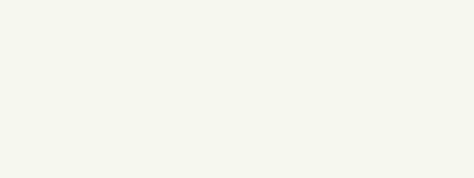

# Itemize — Logo Lottie Animation

A production-ready [Lottie](https://lottiefiles.com/) animation of the **Itemize**
logo, built for pitch/presentation use. Authored against
[`diffusionstudio/lottie`](https://github.com/diffusionstudio/lottie) and rendered
with Skia's **Skottie** engine (CanvasKit-wasm).



## Files

| File | What it is |
|------|-----------|
| `itemize-logo.json` | The Lottie animation (1600×600, 60fps, ~4s). Drop into any Lottie player. |
| `controls.json` | Sidecar describing the editable slots (labels + slider ranges) for the diffusionstudio player. |
| `itemize-logo-preview.gif` | Animated preview for slides / quick sharing. |
| `itemize-logo-still.png` | Final-frame still (the fully assembled logo). |
| `build_lottie.py` | The generator. Re-bakes the JSON from the Liberation Serif Bold glyph outlines — re-run to tweak timing, layout, or colors. |

## The animation

1. **Receipt draws on** — the torn-bottom receipt outline reveals via trim-path while the paper fill fades in.
2. **Checkbox pops in** with a slight overshoot, then the **green check draws on** (trim-path).
3. **List lines + gold accent bar wipe in**, lightly staggered.
4. **"Itemize" wordmark** — real serif glyph outlines (not a font dependency — fully vectorized) **rise from below and fade in, one letter at a time**.
5. **Settle** — a gentle breathing scale on the mark returns to baseline so the clip loops cleanly.

## Editable properties (Skottie slots)

The animation exposes named slots so colors and stroke width can be retargeted
without re-authoring — live in the diffusionstudio player, in After Effects, or
at runtime via Skottie's slot API:

| Slot | Default | Control |
|------|---------|---------|
| `receiptColor` | `#1A1A1A` | color |
| `checkColor` | `#2E8B57` | color |
| `accentBarColor` | `#C8962F` | color |
| `lineColor` | `#CBD3C9` | color |
| `wordmarkColor` | `#1A1A1A` | color |
| `bgColor` | `#F7F6EF` | color |
| `markStrokeWidth` | `9` | slider (4–16) |

## Preview / edit it

The animation renders with **Skottie**, not `lottie-web`. To use the official
player (live properties panel, frame scrubber, per-slot color pickers + the
stroke-width slider):

```bash
npx degit diffusionstudio/lottie itemize-player
cd itemize-player
npm install            # postinstall copies the CanvasKit wasm
cp ../itemize-lottie/itemize-logo.json public/lottie.json
cp ../itemize-lottie/controls.json     public/controls.json
npm run dev            # open the printed localhost URL
```

> If `npm run dev` errors on a missing `@rollup/rollup-linux-*` or
> `lightningcss-*` native module, that's the known npm optional-deps bug —
> `rm -rf node_modules package-lock.json && npm install` fixes it.

For a standard Lottie consumer (web `lottie-web`, iOS, Android, Flutter,
React Native) just load `itemize-logo.json` directly; the slot defaults render
as the final colors shown above.

## Regenerate

```bash
pip install fonttools
python3 build_lottie.py path/to/output/lottie.json
```

Requires Liberation Serif Bold at
`/usr/share/fonts/truetype/liberation/LiberationSerif-Bold.ttf` (the wordmark is
baked from its glyph outlines, so no font ships in the JSON).
